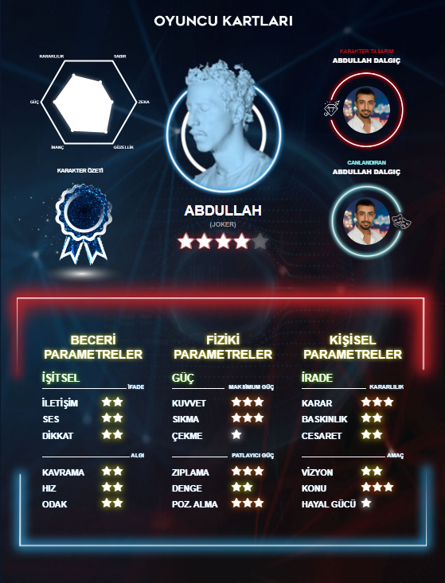
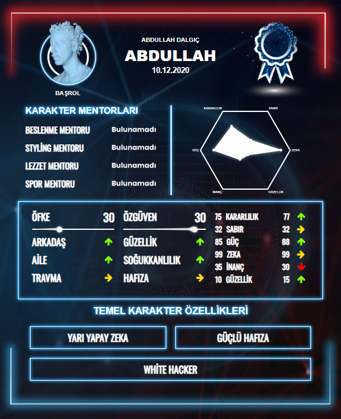

# Oyun Kartı Tasarımı

Bu proje, 2020 yılında hazırlanan bir oyun kartı tasarımını içermektedir. HTML, SCSS ve JavaScript dilleri kullanılarak geliştirilmiştir.

## Proje Özeti

Proje, bir oyun kartının kullanıcı arayüzünü oluşturan basit bir web uygulamasını içerir. Oyun kartında, oyun karakterinin adı, özellikleri ve görseli bulunmaktadır.

## Ekran Görüntüleri





## Teknolojiler

- HTML
- SCSS
- JavaScript

## Kurulum

Projeyi yerel bilgisayarınıza klonlayın:

```bash
git clone https://github.com/AbdullahDalgic/game-card-frontend.git
```

Proje dizinine gidin:

```bash
cd game-card-frontend
```

## License

Bu proje MIT lisansı altında lisanslanmıştır. Detaylı bilgi için LICENSE dosyasına göz atın.
